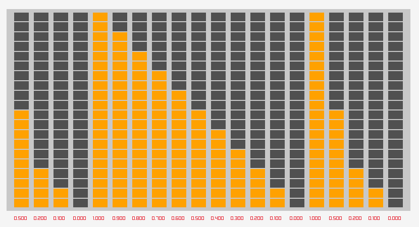

# DrawEQ
The idea was a classic multiband EQ with many columns of sliders on a mixing board.

Allows lightning-fast input of an array of float values in a second.  Can also be used for a display of normalized float values.

Uses RayLib and RayGUI.  With little work it could be made a standard RayGUI control.
